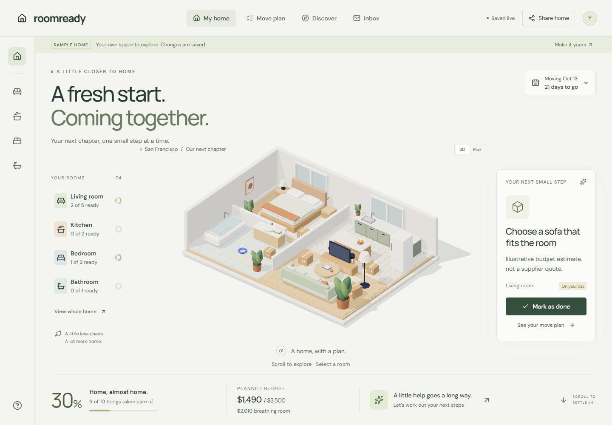

# RoomReady

A collaborative moving-home planner. Explore a furnished 3D home, organize room tasks and estimated costs, and prepare enquiries with your household.

**[Open RoomReady](https://wonderful-vulture-63.convex.site)** · [Source](https://github.com/C-Icaro/roomready) · [PR #1](https://github.com/C-Icaro/roomready/pull/1)



Built for the Convex All Gas Hackathon on September 22, 2026. The app is publicly deployed with the household workflow working. OpenAI, Firecrawl and AgentMail integrations are implemented but remain disabled pending access and credit verification. A demo video, social post and completed submission are still pending. See [hackathon.md](./hackathon.md) for the evidence-based build log.

## Run

Requires Node.js 24 and npm. Dependencies are locked in `package-lock.json`.

```sh
npm ci
npx convex dev
npm run dev
```

The Convex CLI can provision an anonymous **local development** backend. A Convex account and cloud deployment are required for public hosting. The generated `.env.local` is ignored by Git.

## Available in the public app

- Room-based tasks, estimates, owners, priorities and notes, stored in Convex.
- Realtime collaboration and persistence across sessions.
- Original procedural Three.js apartment with scroll-driven camera, room selection, progress-linked packing boxes and a functional 2D fallback.
- Enquiry drafts that persist without sending, plus explicit notices for unavailable services.

## Implemented integrations awaiting activation

- Provider jobs with explicit configuration/error states, bounded usage and timeouts.
- Firecrawl search and URL scraping, with source timestamps and excerpts.
- OpenAI Responses structured planning suggestions, grounded in the home's saved sources.
- AgentMail drafts, explicitly approved sends to controlled recipients, inbox polling and inbound deduplication.

These paths have backend tests with controlled provider fixtures. No successful live call to these providers, email send or received reply has been verified for the public app. Enabling them requires backend credentials and confirmed available credits.

## Deployment and validation

The public frontend is [wonderful-vulture-63.convex.site](https://wonderful-vulture-63.convex.site); its backend is `wonderful-vulture-63` at `https://wonderful-vulture-63.convex.cloud`.

The first meaningful commit, [9737dfa](https://github.com/C-Icaro/roomready/commit/9737dfac4f8226acf50713f3f18bc0eafd99690c), was created at `2026-09-22T04:10:13Z`. [CI run 35685864867 passed](https://github.com/C-Icaro/roomready/actions/runs/35685864867). The baseline has 17 backend tests, and seven browser scenarios passed against the first public deployment across an initial run and one targeted rerun. Coverage includes editing and budgets, two-session synchronization, persistence, shared-link isolation, room navigation, mobile drafts, unavailable-provider errors and WebGL/reduced-motion fallbacks. This does not establish live sponsor integration or validate later uncommitted changes.

Published checkpoint [1855493](https://github.com/C-Icaro/roomready/commit/185549392a14bdacb49fbabc0401e1551c69d7eb) passed 22 unit tests and ten E2E scenarios on the public deployment, including accessibility and narrow-screen checks. It was merged into main with an identical source tree. [Main CI passed](https://github.com/C-Icaro/roomready/actions/runs/35687154455). [Public build identity](https://wonderful-vulture-63.convex.site/build-info.json) and [validation evidence](./submission/validation.json) record the exact source and scope. Three performance runs per viewport measured median first-canvas readiness of 3.12 s desktop and 3.22 s at mobile width on one Windows/Intel machine; this is not a phone hardware measurement.

## Access and privacy

Each home has a random UUIDv4 capability. There is no public list of homes. The capability is held locally and shared in a URL fragment. **Anyone with the link can view and edit the home and its inbox.** Use it only with trusted household members; it is not a substitute for identity-based access control. Sample homes contain labelled fictional tasks and estimates. Do not enter sensitive information into a public hackathon demo.

The backend validates arguments and document ownership. Network access happens only in Convex actions. External content is untrusted data, not executable instructions. Emails require review and an allowlisted recipient. A send with an uncertain outcome is not automatically retried.

## Configure external services

Set these on the **Convex deployment**, never in frontend `VITE_` variables:

- `OPENAI_API_KEY`, optionally `OPENAI_MODEL` (default `gpt-4.1-mini`).
- `FIRECRAWL_API_KEY`.
- `AGENTMAIL_API_KEY` and `AGENTMAIL_ALLOWED_RECIPIENTS` (comma-separated controlled test addresses).
- `EXTERNAL_ACTIONS_ENABLED=true`, only after confirming existing access and available credits.

Use the Convex dashboard or `npx convex env set NAME` with secure stdin. Do not commit secrets. Services start disabled, and the UI reports unavailable services explicitly. Sending is capped, idempotent per draft and never automatically retried after ambiguous delivery.

## Validate and publish

```sh
npm run lint
npm run typecheck
npm test
npm run build
npm run test:e2e
npm run deploy
```

The E2E suite uses Microsoft Edge by default; override the Playwright browser channel for other environments. Local tests expect the frontend and Convex dev server to be running. `E2E_BASE_URL` targets a deployed frontend. `EVIDENCE_DIR` chooses screenshot storage. Provider fixtures in unit tests are **not live provider evidence**.

Deployment uses the official Convex static hosting component and serves the frontend from the production `*.convex.site` alongside its backend. No separate database or hosting provider is required.

## Stack and attribution

React, Vite, TypeScript, Three.js, Lucide and Convex. The apartment geometry and materials are original source in `src/components/apartment-model.ts`, with no third-party 3D assets. Technical inspiration: Three.js [camera](https://threejs.org/examples/webgl_camera.html), [raycast interaction](https://threejs.org/examples/webgl_interactive_cubes.html), [physical lighting](https://threejs.org/examples/webgl_lights_physical.html) and [RoomEnvironment](https://threejs.org/docs/pages/RoomEnvironment.html). Three.js is MIT licensed; no showcase identity or proprietary models are copied.

The official [Convex hackathon skill](https://github.com/get-convex/convex-hackathon-skill) is vendored under `.agents/skills/` under its MIT license. Fonts are DM Sans and Manrope from Google Fonts (SIL Open Font License). Lucide icons are ISC licensed.

The full official Convex Codex plugin 1.10.0 is installed and enabled in the build environment. Development and deployment use the Convex CLI. A real read-only `status` call through the official Convex MCP server in `convex@1.46.0` also succeeded via stdio against the development deployment. Native desktop MCP tool names remain unavailable in this session. The plugin installation and the verified MCP call are separate evidence; neither proves live sponsor integrations.
